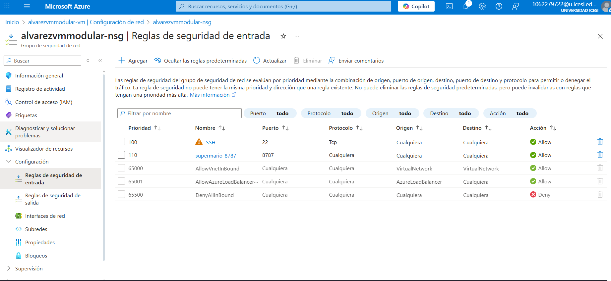

# training-ansible

usuario: admin123

contraseña: Admin123+

vm: ssh admin123@9.163.234.56

## Despliegue de Super Mario Bros en Azure con Ansible y Docker

### 1. Requisitos previos
- Una máquina virtual Ubuntu en Azure (recomendado Ubuntu 20.04 o superior)
- Acceso SSH y permisos de administrador
- Ansible instalado en tu máquina de control
- Docker instalado en la VM (se instala automáticamente con el playbook)

### 2. Actualización de la VM y Python
1. Actualiza el sistema operativo:
	```sh
	sudo apt update
	sudo apt upgrade -y
	sudo apt dist-upgrade -y
	sudo apt install update-manager-core -y
	sudo do-release-upgrade
	```
2. Instala Python 3.10:
	```sh
	sudo add-apt-repository ppa:deadsnakes/ppa -y
	sudo apt update
	sudo apt install -y python3.10 python3.10-distutils
	```
3. (Opcional) Instala pip para Python 3.10:
	```sh
	curl -sS https://bootstrap.pypa.io/get-pip.py | python3.10
	```

### 3. Configuración de Ansible
1. Edita el archivo `inventory/hosts.ini` para usar el intérprete correcto:
	```ini
	[azure_vm]
	9.163.234.56 ansible_python_interpreter=/usr/bin/python3.10 ansible_user=admin123 ansible_ssh_pass=Admin123+
	```
2. Asegúrate de tener en `ansible.cfg`:
	```ini
	[defaults]
	roles_path = ./roles
	inventory = ./inventory/hosts.ini
	```

### 4. Despliegue de Docker y Super Mario Bros
1. Instala Docker y ejecuta el contenedor con Ansible:
	```sh
	ANSIBLE_CONFIG=./ansible.cfg ansible-playbook -i inventory/hosts.ini playbooks/install_docker.yml
	ANSIBLE_CONFIG=./ansible.cfg ansible-playbook -i inventory/hosts.ini playbooks/run_container.yml
	```


### 5. Configuración de red en Azure
1. Ve al portal de Azure y selecciona tu VM.
2. En "Configuración de red", haz clic en el grupo de seguridad de red (NSG).
3. Ve a "Reglas de seguridad de entrada" y haz clic en "Agregar".
4. Crea una regla para permitir el puerto TCP 8787:
	- Origen: Any
	- Puerto de destino: 8787
	- Protocolo: TCP
	- Acción: Permitir
	- Prioridad: 200 (o similar)
	- Nombre: supermario-8787



### 6. Acceso al juego
Abre tu navegador y accede a:
```
http://<IP_PUBLICA_DE_TU_VM>:8787
```
Por ejemplo: http://9.163.234.56:8787

¡Listo! Ahora puedes jugar Mario Bros desde tu navegador usando tu VM en Azure.

